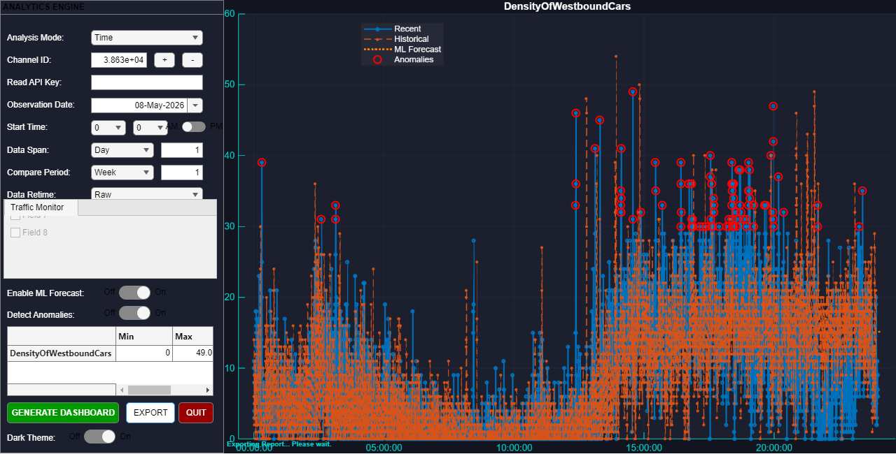

# OmniIoT Analytics: Advanced ThingSpeak Visualization

**OmniIoT Analytics** is a high-performance MATLAB application designed for professional visualization and analysis of IoT data. It allows users to connect to ThingSpeak channels, compare real-time data with historical records, and analyze multi-sensor environments with a modern, modular interface.



## 🚀 Key Features

*   **Dual Mode Analysis**: 
    *   **Time Compare**: Overlay current data with historical periods to identify trends and anomalies.
    *   **Channel Compare**: Synchronize and compare multiple sensors/channels side-by-side.
*   **Modular Architecture**: Decoupled UI and Data logic using a dedicated `ThingSpeakClient` class for easier integration.
*   **Modern UI/UX**: High-contrast "Midnight" theme designed for long-term monitoring dashboards.
*   **Dynamic Data Retiming**: Automatically resample irregular IoT data streams into fixed intervals (Minutely, Hourly, Daily).
*   **Statistical Analysis**: Integrated summary statistics and data export capabilities to the MATLAB workspace.

## 🛠️ Project Structure

*   `toolbox/`: Contains the core MATLAB classes and functions.
    *   `OmniIoTAnalyst.m`: Main Application interface.
    *   `ThingSpeakClient.m`: API connector for ThingSpeak REST services.
    *   `DataAnalytics.m`: Helper functions for data processing.
*   `resources/`: Visual assets, icons, and theme definitions.
*   `doc/`: Interactive MATLAB Live Scripts for tutorials.

## 🏁 Getting Started

### Prerequisites
*   MATLAB R2021a or later.
*   ThingSpeak Support Toolbox.

### Installation & Run
1.  **Clone the repository**:
    ```bash
    git clone https://github.com/YOUR_USERNAME/OmniIoT-Analytics.git
    ```
2.  **Initialize the project**:
    Open MATLAB, navigate to the project folder and run:
    ```matlab
    setup_project.m
    ```
3.  **Launch the App**:
    ```matlab
    app = OmniIoTAnalyst;
    ```

## 📈 Usage Guide

1.  **Select Mode**: Choose between "Time" or "Channel" mode in the dropdown.
2.  **Input Credentials**: Enter your **Channel ID** and **Read API Key** (for private channels).
3.  **Configure Window**: Set the start date and duration (e.g., last 3 days).
4.  **Visualize**: Click **UPDATE**. Use the field checkboxes to filter specific sensor data.
5.  **Export**: Click **Export to Workspace** to save the processed Timetables for further analysis.

## 📝 Authors & Credits
*   **Main Developer**: [SANI Raouf]
*   **Inspiration**: Based on the original IoT Data Explorer by MathWorks.

---
*This project is provided under the MIT License.*
